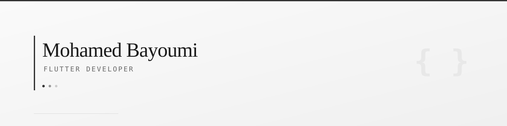

  

  
  

## Hey there 

I'm Mohamed — a Flutter developer from Cairo who loves turning ideas into smooth, cross-platform apps. I've been building with Flutter for about 2 years now, and I genuinely enjoy the whole process: from figuring out the right architecture to polishing that last animation.

I'm a CS student at Ain Shams University (graduating 2027), and when I'm not studying, I'm usually deep in some Flutter project trying out a new state management approach or playing around with Firebase.

---

### What I'm up to right now

- 🛠️ Building **Mohsens Tracker** — a student committee management app with Flutter + Firebase
- 💼 Flutter trainee through the **ITIDA + Gigs** program (Ministry of Communications & IT)
- 🎓 Just wrapped up the **ITI Flutter Winter Training Program**

---

### Things I work with

**Languages & Frameworks**

  
  
  
  

**State Management & Architecture**

  
  
  
  

**Backend & Databases**

  
  
  
  
  

**Tools I use daily**

  
  
  
  

---

### Some projects I've built

**🏥 MediFlow Pro — Smart Clinic Manager**
`Flutter` `Clean Architecture` `Riverpod` `Firebase` `GoRouter` `Material 3`

A full clinic management app with 3 separate portals (Patient, Doctor, Admin). Built it with Clean Architecture and Riverpod, has 15+ screens, push notifications, an analytics dashboard with fl_chart, and an offline demo mode so you can try everything without signing up.

**🛒 E-Commerce App**
`Flutter` `Cross-Platform`

A mobile shopping app with product browsing, cart, and order tracking — works on both Android and iOS.

**📖 Recipe App**
`Flutter` `BLoC` `Hive` `Lottie`

An offline-first recipe manager that stores everything locally with Hive. Supports Arabic & English, has smooth Lottie animations, and uses BLoC to keep things clean under the hood.

---

### 📊 GitHub Stats

  

---

### 🎓 Education

**B.Sc. Computer Science** — Ain Shams University, Faculty of Science *(Expected 2027)*

CS50 certified (Harvard/edX) — which is where I really fell in love with problem solving.

---

  I'm always open to interesting projects and collaborations — feel free to reach out!

